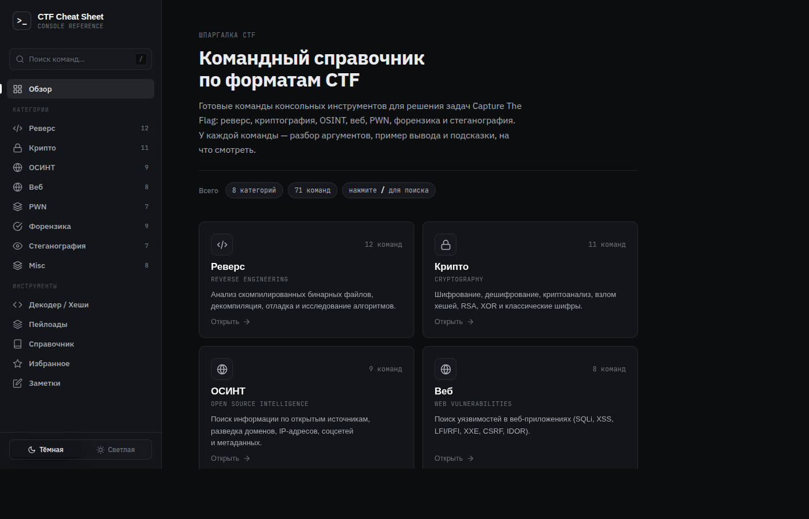

# CTF Cheat Sheet

> Командный справочник для решения задач Capture The Flag — прямо в браузере, без установки.

**[Открыть сайт →](https://sergeifed2015-pixel.github.io/ctf-cheatsheet/)**



---

## Что внутри

### 8 категорий, 70+ команд

Каждая команда содержит: разбор всех аргументов, реальный пример вывода в терминале и блок «на что обратить внимание» — что искать в выводе чтобы найти флаг.

| Категория | Инструменты |
|---|---|
| **Реверс** | strings, file, objdump, ltrace, strace, gdb, ghidra, nm, xxd, upx |
| **Крипто** | openssl, gpg, base64, hashcat, john, python3 (RSA/XOR/Caesar) |
| **ОСИНТ** | whois, nslookup, dig, subfinder, theHarvester, exiftool, curl |
| **Веб** | curl, ffuf, nikto, sqlmap, hydra, jwt_tool, wfuzz, gobuster |
| **PWN** | gdb+pwndbg, checksec, ROPgadget, one_gadget, pwntools, seccomp-tools |
| **Форензика** | binwalk, foremost, volatility, wireshark, strings, dd, scalpel |
| **Стеганография** | steghide, zsteg, stegsolve, exiftool, sox, ffmpeg, python LSB |
| **Misc** | nmap, socat, python3 http.server, base64/32/58, xxd |

---

## Возможности

### Анализ файлов
Загрузите любой файл прямо в нужный раздел — инструмент проанализирует его на стороне браузера (без отправки на сервер) и покажет:
- Тип файла по magic bytes, энтропию, hex-дамп
- Результаты симулированных утилит: `strings`, `xxd`, `binwalk`, `checksec`, `exiftool` и других
- Блок **«Что делать дальше»** — конкретные шаги и команды исходя из найденных данных

### Декодер / Энкодер
Мгновенное преобразование прямо в браузере:
`Base64` · `Hex` · `URL` · `ROT-N` · `Binary` · `Morse` · `HTML entities` · `Decimal`

Кнопка **«Авто-определить»** сама находит кодировку по содержимому.

### Идентификатор хешей
Вставьте хеш — получите алгоритм и готовые команды для `hashcat` и `john`:
```
5d41402abc4b2a76b9719d911017c592  →  MD5  (-m 0)
$2y$10$...                         →  bcrypt  (-m 3200)
```

### Библиотека пейлоадов
~50 готовых пейлоадов с описаниями и примечаниями:

`SQL Injection` · `XSS` · `SSTI` · `LFI / Path Traversal` · `Command Injection` · `XXE`

### Шаблоны скриптов
Готовые Python-шаблоны в разделах **PWN** и **Крипто**:
- pwntools: `ret2win`, `ret2libc`, `format string`
- Крипто: `RSA` (4 атаки), `XOR brute force`, `Caesar/Vigenère`

### Справочник
Быстрые таблицы без поиска в Google:
- **Порты** — 26 портов с конкретными CTF-командами для каждого
- **Форматы флагов** — HTB, THM, picoCTF, pwn.college и ещё 11 платформ
- **Wordlists** — пути к спискам на Kali с указанием размера и назначения
- **Magic bytes** — 19 форматов файлов с hex-сигнатурами

### Избранное и заметки
- **★** — отметить любую команду в избранное (localStorage, только ваше)
- **Заметки** — локальный блокнот для текущей CTF-сессии, автосохранение

### Пользовательские команды
Добавляйте свои команды в любую категорию через форму — сохраняются в localStorage между сессиями.

---

## Технологии

Чистый HTML + CSS + JavaScript — без фреймворков, без сборки, без зависимостей. Работает полностью в браузере, все данные хранятся локально.

---

## Локальный запуск

```bash
git clone https://github.com/sergeifed2015-pixel/ctf-cheatsheet
cd ctf-cheatsheet
python3 -m http.server 8080
# открыть http://localhost:8080
```
