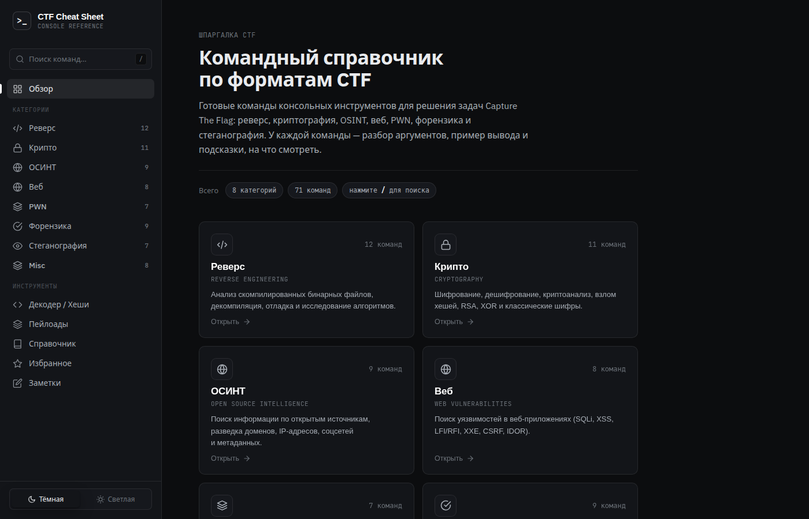
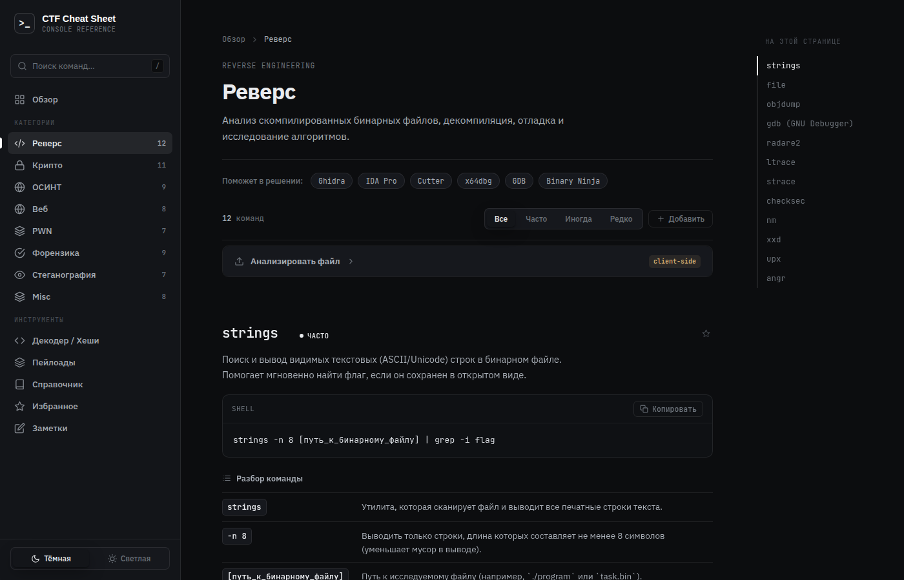
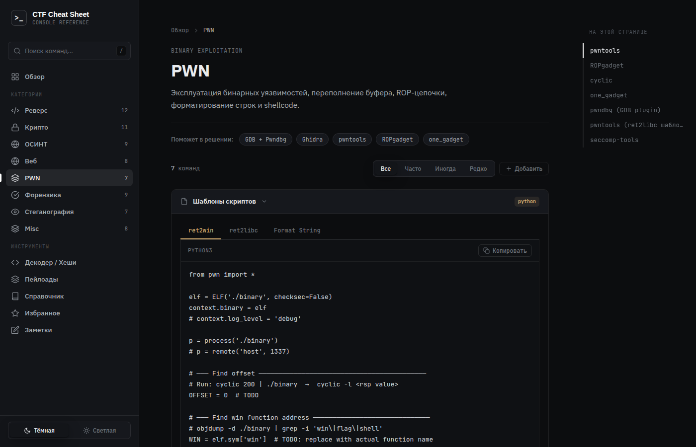
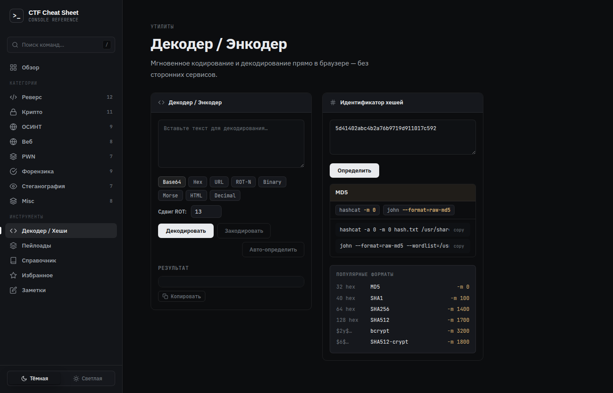
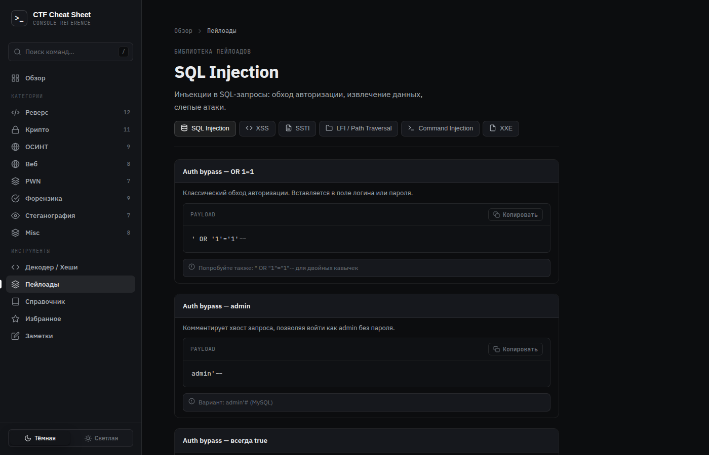
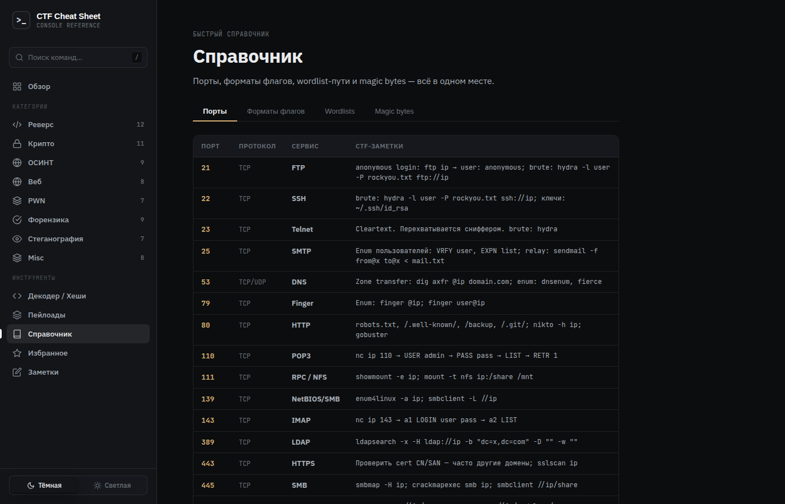

# CTF Cheat Sheet

> Командный справочник для решения задач Capture The Flag — работает прямо в браузере, без установки.

**[→ Открыть сайт](https://sergeifed2015-pixel.github.io/ctf-cheatsheet/)**

---

## Скриншоты

<table>
  <tr>
    <td><br/><sub>Главная — обзор категорий</sub></td>
    <td><br/><sub>Категории с командами, разбором аргументов и примерами вывода</sub></td>
  </tr>
  <tr>
    <td><br/><sub>Шаблоны pwntools: ret2win, ret2libc, format string</sub></td>
    <td><br/><sub>Декодер (Base64/Hex/ROT/Morse/…) + определение хешей</sub></td>
  </tr>
  <tr>
    <td><br/><sub>Пейлоады: SQLi, XSS, SSTI, LFI, CMDi, XXE</sub></td>
    <td><br/><sub>Порты, форматы флагов, wordlists, magic bytes</sub></td>
  </tr>
</table>

---

## Возможности

### Команды по категориям — 8 разделов, 70+ команд

| Категория | Инструменты |
|---|---|
| **Реверс** | strings, file, objdump, ltrace, strace, gdb, ghidra, nm, xxd, upx |
| **Крипто** | openssl, gpg, base64, hashcat, john, python3 (RSA/XOR/Caesar) |
| **ОСИНТ** | whois, nslookup, dig, subfinder, theHarvester, exiftool, curl |
| **Веб** | curl, ffuf, nikto, sqlmap, hydra, jwt_tool, wfuzz, gobuster |
| **PWN** | gdb+pwndbg, checksec, ROPgadget, one_gadget, pwntools, seccomp-tools |
| **Форензика** | binwalk, foremost, volatility, wireshark, strings, dd, scalpel |
| **Стеганография** | steghide, zsteg, stegsolve, exiftool, sox, ffmpeg, python LSB |
| **Misc** | nmap, socat, python3 http.server, base64/32/58, xxd |

Каждая команда содержит: разбор всех аргументов, реальный пример вывода и блок «на что обратить внимание».

---

### Анализ файлов

Загрузите файл прямо в нужный раздел — анализ выполняется в браузере (файл никуда не отправляется):

- Определение типа по **magic bytes**, энтропия, hex-дамп
- Симуляция утилит: `strings`, `xxd`, `binwalk`, `checksec`, `exiftool` и других
- Блок **«Что делать дальше»** — конкретные шаги и команды исходя из найденных данных (высокая энтропия → распаковка, нет canary → BOF, JPEG с данными за FFD9 → извлечь хвост и т.д.)

---

### Декодер / Энкодер

Мгновенное преобразование без внешних сервисов:

`Base64` · `Hex` · `URL` · `ROT-N` · `Binary` · `Morse` · `HTML entities` · `Decimal`

Кнопка **«Авто-определить»** сама находит формат по содержимому.

---

### Идентификатор хешей

Вставьте хеш → алгоритм + готовые команды для `hashcat` и `john`:

```
5d41402abc4b2a76b9719d911017c592  →  MD5   (hashcat -m 0)
$2y$10$xxxxx                       →  bcrypt (hashcat -m 3200)
$6$salt$xxxxx                      →  SHA512-crypt (hashcat -m 1800)
```

---

### Библиотека пейлоадов

~50 готовых пейлоадов с описаниями и примечаниями:

| Категория | Что внутри |
|---|---|
| **SQL Injection** | Auth bypass, UNION extract, error-based, blind time/boolean, WAF bypass |
| **XSS** | script/img/svg, attr injection, cookie steal, CSP bypass, polyglot |
| **SSTI** | Jinja2 RCE, Twig RCE, Freemarker, ERB, Velocity, filter bypass |
| **LFI / Path Traversal** | Unix/Windows traversal, double encode, PHP filter, log poisoning |
| **Command Injection** | Разделители, blind OOB, пробел-bypass, reverse shells (bash/python/nc) |
| **XXE** | File read, SSRF, PHP filter, blind OOB, Windows |

---

### Шаблоны скриптов

Готовые Python-шаблоны в разделах **PWN** и **Крипто**:

- **PWN**: `ret2win`, `ret2libc`, `format string` — полные рабочие скрипты pwntools с TODO-комментариями
- **Крипто**: `RSA` (4 атаки: small e, factoring, common modulus, Wiener), `XOR brute force`, `Caesar/Vigenère`

---

### Справочник

Быстрые таблицы вместо поиска в Google:

- **Порты** — 26 портов с конкретными CTF-командами (FTP anon, SMB enum, Redis config, MSSQL xp_cmdshell…)
- **Форматы флагов** — 15 платформ: HTB, THM, picoCTF, pwn.college, CHTB и другие
- **Wordlists** — пути на Kali с размером и назначением каждого
- **Magic bytes** — 19 форматов с hex-сигнатурами

---

### Избранное и заметки

- **★** — отметить любую команду в избранное (хранится в браузере, только ваше)
- **Заметки** — локальный блокнот для CTF-сессии, автосохранение

---

### Прочее

- **Поиск** по всем командам (`/` для фокуса)
- **Тёмная / светлая** тема
- **Добавление своих команд** через форму — сохраняются между сессиями
- **Информация об инструментах** — клик по чипу в разделе показывает описание и ссылку для скачивания

---

## Технологии

Чистый HTML + CSS + JavaScript — без фреймворков, без сборки, без зависимостей.  
Работает полностью в браузере, все данные хранятся локально в `localStorage`.

---

## Локальный запуск

```bash
git clone https://github.com/sergeifed2015-pixel/ctf-cheatsheet
cd ctf-cheatsheet
python3 -m http.server 8080
# открыть http://localhost:8080
```
